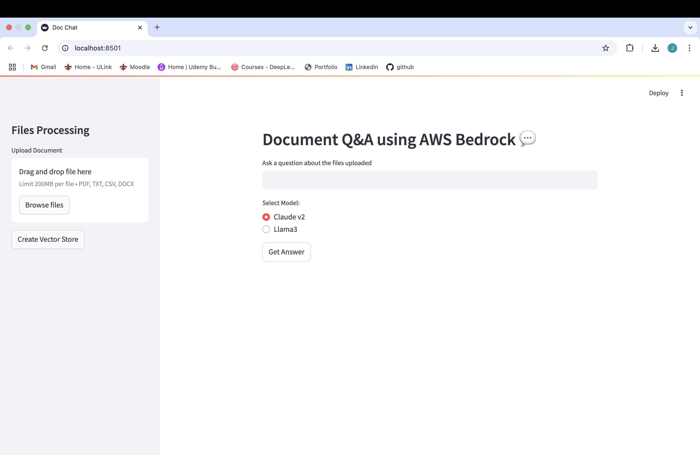

<div align="center">

# 📄 Document Q&A using AWS Bedrock

</div>

This application leverages AWS Bedrock's foundation models (Claude v2 and Llama3-70b) through a sophisticated LangChain pipeline. The system processes documents (PDF, TXT, CSV, DOCX) using document loaders, splits text with recursive character splitting (10k chunks, 1k overlap), generates embeddings with Amazon Titan Embed Text v2, and stores them in FAISS for efficient similarity search. The agent-based architecture allows for natural language question answering with context-aware responses.




[](LICENSE)
[](https://python.org)
[](https://aws.amazon.com/bedrock/)

## 🚀 Powerful Document Question Answering System

### ✨ Key Features

🔹 **Multi-format Support**: Process PDF, TXT, CSV, DOCX documents with ease
🔹 **Smart Chunking**: Advanced recursive text splitting with overlap
🔹 **Dual LLM Power**: Choose between Claude v2 or Llama3-70b models
🔹 **Context-Aware**: Responses include source document references
🔹 **Real-time UI**: Streamlit interface with progress indicators


### 🔧 Technical Architecture

- **Document Processing**: Supports multiple file types (PDF, TXT, CSV, DOCX) with LangChain document loaders
- **Text Splitting**: Recursive character splitting with 10,000 character chunks and 1,000 character overlap
- **Vector Embeddings**: Uses Amazon Titan Embed Text v2 model for document embeddings
- **Vector Store**: FAISS for efficient similarity search
- **LLM Options**: Choose between Claude v2 or Llama3-70b models

### ⚙️ Setup

1. Install requirements:
```bash
pip install -r requirements.txt
```

2. Configure AWS credentials with Bedrock access

3. Run the application:
```bash
streamlit run bedrockLLM.py
```

### 💡 Usage

1. Upload your document
2. Click "Create Vector Store" to process the file
3. Select your preferred LLM model
4. Ask questions about your document

### 🌟 Features

- Clean Streamlit UI with file upload and question input
- Real-time processing status indicators
- Support for multiple document formats
- Choice of powerful LLM models
- Context-aware responses with source document references